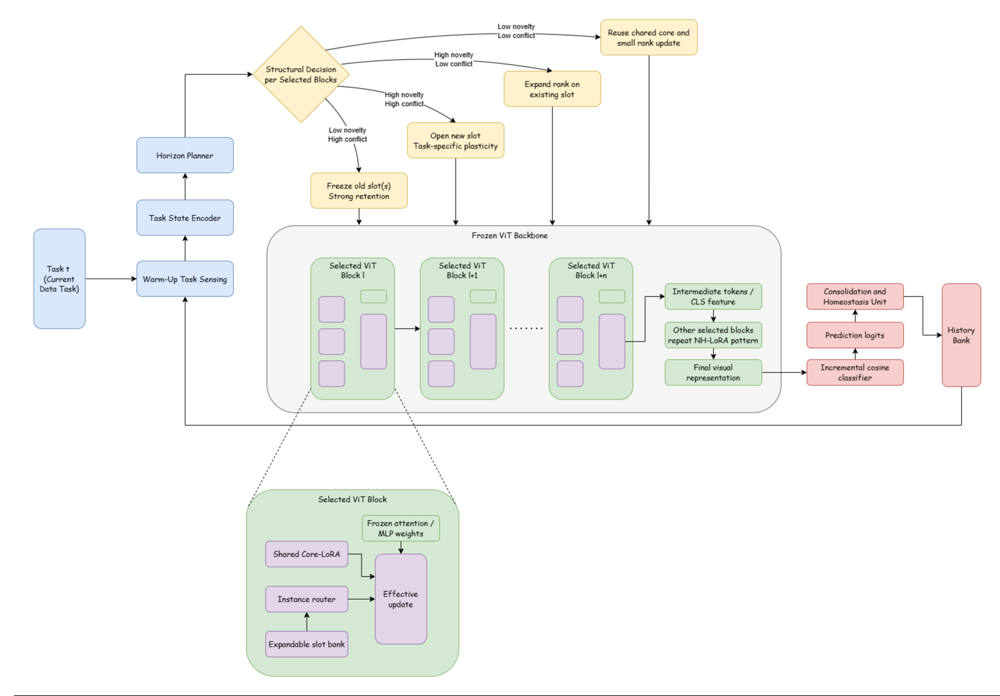

# NH-LoRA: Future-Aware Structural Expansion of Low-Rank Adapters for Rehearsal-Free Class-Incremental Learning

  
  
  

This repository contains the official implementation of NH-LoRA: Future-Aware Structural Expansion of Low-Rank Adapters for Rehearsal-Free Class-Incremental Learning.

## Architecture Design
