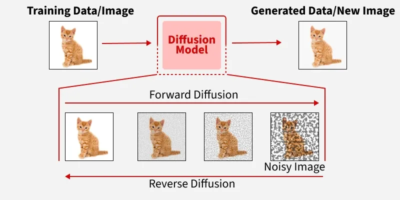

H-LoRA Docs
---

# Preface
> Tl;dr : We proposed new LoRA architecture called NH-LoRA, and show it's performance on fine tuning vit model (hakurei/waifu-diffusion)

This project is experimental, unique, and quite speedrun something (i don't know what to write here). A KCVanguard Project, part of [KCV](https://www.instagram.com/peopleatkcv/) Lab Recruitment

Our model :

Our deployment : 

##### Notes

For those who already familiar with Diffusion Models, and kinda wonder what is the reasoning behind the `architecture`, we have some source that highly recommend to helps understanding this projects :

https://arxiv.org/pdf/2304.06027
C-LoRA on Diffusion Model

https://arxiv.org/pdf/1505.04597
U-Net: Goat architecture in generative model

Or just skips to [Here](#h-lora-key-point)

## Image Classification

> Tl;dr :
> Image Classification is the task of give a label (or category) to an image.

### Source :
https://www.ibm.com/topics/image-classification

Every trained model on image classification have common `core idea` :  
- Input image (ofc)
- Passes it through a series of layers (to extracts visual patterns)
- Decides the most likely categories

There are two (afaik) main architecture in image classification, CNN and VisionTransformer.

We will focusing on VisionTransformers architecture here, which should be explained detailed soon.

## Vision Transformer (ViT)

> Tl;dr :
> Vision Transformers (ViT) is a the **Transformer architecture** but for images, works by treating image patches as tokens.

### Source :
https://arxiv.org/abs/2010.11929

Transformers? Thought that was for NLP, iirc? Yep, but the idea actually can be used for images as well. I think better we explained some concept here to connect the dots (make sure we are on the same page)...    

### Transformers
> Tl;dr :
> Transformers are models that process a sequence by letting each element compare itself with the others, instead of reading everything in a fixed left-to-right order.

traditional transformer encoder-decoder architecture where, if you’re familiar  “Attention Is All You Need” [1] paper?

A Transformer does not try to understand a sequence only from local neighbors. Instead, it uses **self-attention** to decide which parts of the input are important for each element.

In a Transformer, the input is treated as a sequence of tokens. Each token gets turned into a vector, and then the model updates those vectors by looking at the whole sequence at once. So every token can “pay attention” to the others, which helps the model capture long-range relationships very well.

In NLP, it does have advantage as 

There are a few important pieces here:

- **Self-Attention**  
  This is the part that lets one token gather information from other tokens. If one part of the input is more relevant, the model can give it a bigger weight.

- **Multi-Head Attention**  
  Instead of using just one attention pattern, the model uses several heads. Each head can focus on different kinds of relationships at the same time. One head may look at local structure, while another may capture global context.

- **Feed-Forward Network (MLP)**  
  After attention, each token is processed by a small neural network. This gives the model more capacity to transform the information it just collected.

- **Residual Connections + LayerNorm**  
  These help training stay stable. Residual connections preserve information from earlier layers, and LayerNorm makes the optimization smoother.

So in short, a Transformer is basically a stack of attention and MLP blocks that repeatedly refine the input representation.

... so, how we modifiy this for images ?

### Patch Embedding

CNNs usually work by sliding filters over the image and extracting local features little by little. ViT takes a different route: it **cuts the image into fixed-size patches** and treats each patch as one token in a sequence.

For a 224×224 image with patch size 16×16:

$$
\text{Number of patches} = \frac{224}{16} \times \frac{224}{16} = 14 \times 14 = 196 \text{ patches}
$$

Each patch is then flattened and mapped into a $D$-dimensional embedding using a linear projection. A special **[CLS] token** is added at the beginning of the sequence, and its final representation is later used for classification.

So instead of working with raw pixels directly, ViT works with a sequence of vectors. At that point, the structure starts to look very similar to how Transformers handle text.

### Positional Encoding

One problem with Transformers is that they do not naturally know the order of the input. In text, word order matters. In images, spatial position matters too. Without extra help, the model would know the patches exist, but not where they came from.

That is why ViT adds **positional embeddings** to the patch embeddings. These embeddings give the model information about where each patch belongs in the original image.

$$
z_0 = [x_{\text{class}}; x_p^1 E; x_p^2 E; \ldots; x_p^N E] + E_{\text{pos}}
$$

Here, $E$ is the patch projection matrix, $E_{\text{pos}}$ is the positional embedding, and $x_p^i$ is the $i$-th patch.

In simple words, the patch tells the model **what** it sees, and the positional embedding tells the model **where** it sees it.

### Transformer Encoder

After patch embedding and positional information are added, the sequence goes through a standard **Transformer Encoder**. This encoder is made of repeated blocks, and each block usually contains:

- **Multi-Head Self-Attention (MSA)** — lets each patch look at all the other patches
- **MLP / Feed-Forward Network** — transforms each token separately after attention
- **Layer Normalization** — keeps training stable and easier to optimize

The structure is usually written like this:

$$
z'_l = \text{MSA}(\text{LN}(z_{l-1})) + z_{l-1}
$$

$$
z_l = \text{MLP}(\text{LN}(z'_l)) + z'_l
$$

What happens here is pretty neat. First, self-attention mixes information across patches, so the model can learn global relationships. Then the MLP refines each token representation individually. The residual connections make sure the original information is not lost too quickly.

After all encoder layers are done, the final **[CLS] token** is passed into a classification head, usually a simple linear layer, to produce the final prediction.

So the flow is basically:

- image → patches
- patches → embeddings
- embeddings + position → Transformer Encoder
- [CLS] token → class prediction

# PEFT (Parameter Efficient Tunning) 
PEFT, in short, is the practice of not training all the parameters, and instead, do the modification only on some components of the model.

Why? Because training all LLM parameters are really, really long. We don't have that much time, this methods can even give results that converge, even more, than pure fine-tuning LLM. So almost same result with less time.  

For time efficiency we’re gonna skip a lot and just focus on LoRA

## LoRA

### What r cons ?

Connect the cons with H-LoRA pros.

## H-LoRA (Key Point)
This is the main part btw, better be focused. We'll try to simplify some terms, while also keeps the essential things

H-LoRA = Fine-tuning Technique 

### What's the difference ?

# Training 

Model ? We use stable diffusion model, hakurei/waifu-diffusion

# Evaluation

https://github.com/deepghs/sdeval

## CCIP

## BikiniPlus

## AICorrupt

# Conclusions 

# Sources
https://arxiv.org/abs/2006.11239