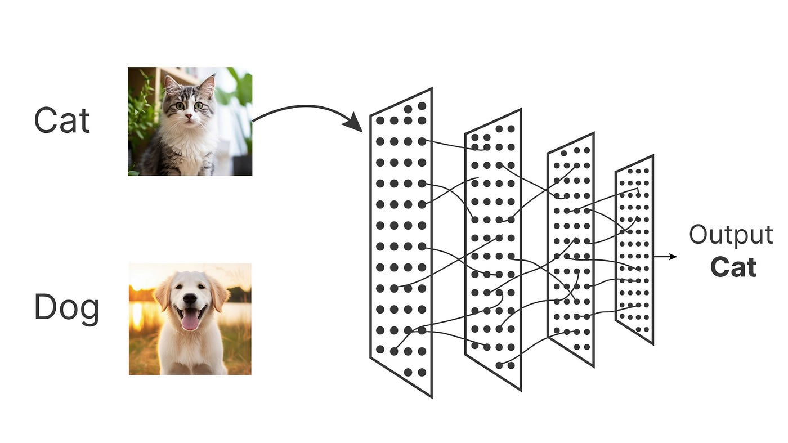
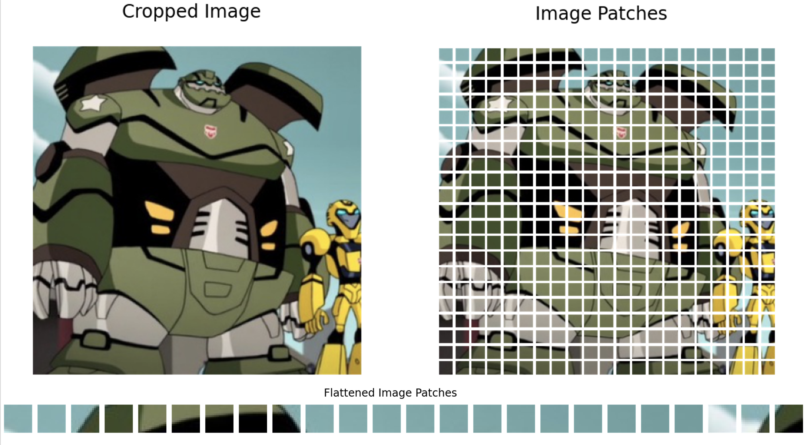
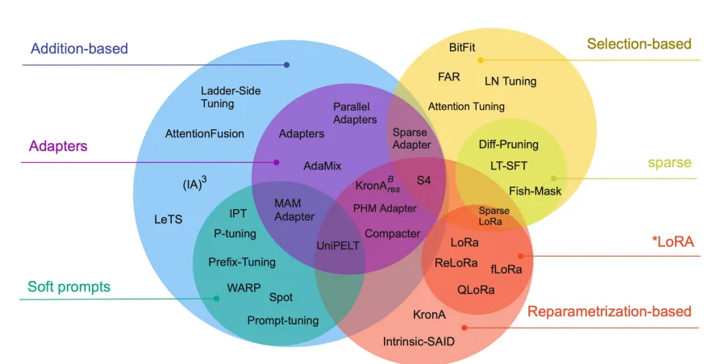
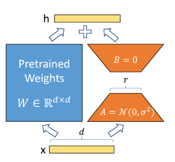

NH-LoRA (Neuromorphic Horizon LoRA)
---

# Preface
> Tl;dr :  <br> We proposed new LoRA architecture called NH-LoRA, 
and show it's performance on fine tuning vit model (hakurei/waifu-diffusion)


This project is experimental, unique, and quite speedrun something (i don't know what to write here). A KCVanguard Project, part of [KCV](https://www.instagram.com/peopleatkcv/) Lab Recruitment


Our model :

Our deployment : 


##### Notes

For those who already familiar with Diffusion Models, and kinda wonder what is the reasoning behind the `architecture`, we have some source that highly recommend to helps understanding this projects :

https://arxiv.org/pdf/2304.06027
C-LoRA on Diffusion Model

https://arxiv.org/pdf/1505.04597
U-Net: Goat architecture in generative model

Or just skips to [Here](#h-lora-key-point)


## Image Classification

> Tl;dr : <br>
> Image Classification is the task to give a label to an image.

Every image classification model have this common `idea` :  
- Input the image 
- Passes it through a series of layers 
- Decides the most likely categories




If we take a closer look at this task, we will find these two terms often: `CNN` and `Vision Transformer`. These are two major architectures in image classification, and they work in different ways. For the sake of simplicity, we will focus on the Vision Transformer architecture here.


## Vision Transformer (ViT)

> Tl;dr : <br>
> Vision Transformers (ViT) is a the **Transformer** but for images, works by treating image patches as tokens.


Transformers? Thought that was for NLP, iirc? Yep, but the idea actually can be used for images as well. I think better we explained some concept here to connect the dots (make sure we are on the same page)...    

### Transformers
> Tl;dr : <br>
> Transformers are models that process a sequence by letting each element compare itself with the others, instead of reading everything in a fixed (left-to-right) order.

Btw, If you have read about the infamous **"Attention Is All You Need"** paper, then maybe you should just skip this and go to this [Vision Transformer](#) or  [NH-LoRA](#h-lora-key-point)

So, Transformer is identical with attention (imo since these two terms are often mentioned together).

```
... attention, like how much we put attention into something ? 
```

#### Attention

I think, better if we explain these use sentence :

<b>
The animal didn't cross the street because it was too tired
</b>

<br>
<br>
In Natural Language Processing, that sentence would be converted into tokens. These can be whole words, subwords, or character pieces .. depending on the tokenizer. For this examples, the sentences are converted into these tokens :

```
The_ | animal_ | didn_ | '_ | t_ | cross_ | the_ | street_ | because_ | it_ | was_ | too_ | tire | d_
```

Based on the infamous paper [] each token gets projected into three vectors, Query (Q), Key (K), Value (V), and the attention score between tokens will be :

$$
\text{Attention}(Q, K, V) = \text{softmax}\left(\frac{QK^T}{\sqrt{d_k}}\right)V
$$

Now, we will use some math to find out how much `it_` "pays attention" to `animal_` compared to `street_`.

##### Some Math

Let’s take an example. Assume this hypothetical vector values that a trained model might output for these words.

So, example vectors:

- Query for `"it_"` \(\left(Q_{\text{it}}\right)\): \([0.6,\ 0.3,\ -0.4,\ 0.8]\)
- Key for `"animal_"` \(\left(K_{\text{animal}}\right)\): \([0.5,\ 0.4,\ -0.3,\ 0.7]\)
- Key for `"street_"` \(\left(K_{\text{street}}\right)\): \([-0.2,\ 0.1,\ 0.5,\ -0.3]\)
- Key for `"was_"` \(\left(K_{\text{was}}\right)\): \([0.3,\ 0.1,\ -0.1,\ 0.5]\)

Assume \(d_k = 4\), so the scaling factor is:

\[
\sqrt{d_k} = \sqrt{4} = 2
\]

First, compute the raw score for `"it_"` attending to `"animal_"`:

\[
Q_{\text{it}} \cdot K_{\text{animal}}
= (0.6)(0.5) + (0.3)(0.4) + (-0.4)(-0.3) + (0.8)(0.7)
= 0.30 + 0.12 + 0.12 + 0.56
= 1.10
\]

Now compute `"it_"` attending to `"street_"`:

\[
Q_{\text{it}} \cdot K_{\text{street}}
= (0.6)(-0.2) + (0.3)(0.1) + (-0.4)(0.5) + (0.8)(-0.3)
= -0.12 + 0.03 - 0.20 - 0.24
= -0.53
\]

Then compute `"it_"` attending to `"was_"`:

\[
Q_{\text{it}} \cdot K_{\text{was}}
= (0.6)(0.3) + (0.3)(0.1) + (-0.4)(-0.1) + (0.8)(0.5)
= 0.18 + 0.03 + 0.04 + 0.40
= 0.65
\]

Now scale by \(\sqrt{d_k}\):

\[
\left[\frac{1.10}{2},\ \frac{-0.53}{2},\ \frac{0.65}{2}\right] =
[0.55,\ -0.265,\ 0.325]
\]

Apply softmax:

\[
\text{softmax}([0.55,\ -0.265,\ 0.325])
\approx [0.45,\ 0.20,\ 0.35]
\]

So `"it_"` puts roughly 45% of its attention weight on `"animal_"`, 35% on `"was_"`, and 20% on `"street_"`.

The output embedding of `"it_"` becomes a weighted blend of the value vectors, with the strongest contribution coming from `"animal_"`.


At the end, it will be something like this :
<div style="width:100%; height:100vh; margin:0; padding:0;">
  <iframe
    src="https://editor.p5js.org/arthamna/full/5izAegixQ"
    style="width:100%; height:100%; border:0; display:block;"
    allowfullscreen
  ></iframe>
</div>

<br>

(A reminder that those are dummy numbers for visualization purposes)


### Vision Transformer

Alright, now we know how to count attention with words. How these works for image ? Oh, and how about the Transformers architecture ? We just skip it ?

Well, since we still haven’t touched on the proposed architecture, and I think a deeper discussion would go too far off topic, we'll focus directly to ViT and some of its part that related to Transformers. You can googling, read related papers, or ask LLM if you want to delve deeper into these topics.

#### Patch Embedding
Anyway, Vision Transformer works by cutting the image into patches and treating each patch like a token in a sentence.

For example, a 224×224 image with patch size 16×16:

$$
\text{Number of patches} = \frac{224}{16} \times \frac{224}{16} = 14 \times 14 = 196 \text{ patches}
$$

Each patch is then flattened and mapped into a $D$-dimensional embedding using a linear projection (like $[w,x,y,z]$ in attention chapter..). It's called patch embedding 




### Positional Encoding

We have the embedding, now start count attention score ? Not really. 

One problem with Transformers is we need to give the order of the input. If you shuffled all the tokens randomly and fed them... well, it still works, but it won't give good information for the model to "understand" the context. The model won't find any difference for an orange image or a scrambled orange puzzle.

With text, it's easy with text because they are ordered, like how we read them from left to right. With images... they don't have natural "reading order" the like words. Patch number 7 isn't inherently "after" patch 6 in any meaningful sense, but patch of "orange and round" means something very different if it's in the top-left corner versus the center versus the bottom-right. To solve this, we add **positional embeddings**

The final embedding $z_0$ are derived from this calculation :

$$
z_0 = [x_{\text{class}}; x_p^1 E; x_p^2 E; \ldots; x_p^N E] + E_{\text{pos}}
$$

With :
- $x_{\text{class}}$: A special, extra "classification token" prepended to the sequence (it gathers the final global image info to make a prediction).
- $x_p^i E$: This is your image patch ($x_p^i$) multiplied by a linear projection matrix ($E$). This just means we've squashed a patch of pixels into a vector of numbers.
- $E_{\text{pos}}$: The positional embedding matrix.


The reasoning here is basically to make the embedding more grouped by position. 

#### Some Math 

Let's take an example. Imagine we are looking at a picture of a landscape. Patch 1 is the top-left corner (blue sky), and Patch 16 is the bottom-right corner (which happens to be a blue lake). Visually, they might look identical.

Let's say our embedding dimension is $4$:
- Visual Embedding for Patch 1 (Sky): $[0.8, 0.2, 0.9, 0.1]$
- Visual Embedding for Patch 16 (Lake): $[0.8, 0.2, 0.9, 0.1]$

If we stopped here, the model would think these two patches are the exact same thing in the exact same context. Now, let's add the positional embeddings ($E_{\text{pos}}$):

- Positional Embedding for Position 1 (Top-Left): $[0.1, 0.0, 0.1, 0.0]$
- Positional Embedding for Position 16 (Bottom-Right): $[-0.1, 0.5, -0.1, 0.2]$

Now, we do the math ($z_0$):

- Final Patch 1 Input: $[0.8 + 0.1, 0.2 + 0, 0.9 + 0.1, 0.1 + 0] = \mathbf{[0.9, 0.2, 1.0, 0.1]}$
- Final Patch 16 Input: $[0.8 - 0.1, 0.2 + 0.5, 0.9 - 0.1, 0.1 + 0.2] = \mathbf{[0.7, 0.7, 0.8, 0.3]}$

Ohh? Even though the visual pixels were identical, the final embedding are different, based on the position.

Finally, this embedding will be input for Transformer architecture, with it's attention mechanism, MLP head yadda yadda... 


## (Incremental) Image Classification

In image classification, a model is trained on a fixed set of classes, so the model only learns to recognize  classes with that domain.

What if we want to add a new class later ? 

"Well, we can fine-tune it"... Yup, but we need to remember that fine-tuning is closely related to forgetting. The model may learn the new concept well, but at the same time it may lose some ability to recognize the old ones, which known as forgetting. 

So, incremental learning can be viewed as a special task in fine-tune domain. We add new classes over time while try to preserve performance on previously learned classes.

Formally, we can think of the learning process as a sequence of tasks $\mathcal{T}_1, \mathcal{T}_2, \ldots, \mathcal{T}_t$, where each task $\mathcal{T}_i$ introduces a new set of classes $\mathcal{C}_i$.

After training on task $t$, the model should still be able to correctly classify images from all classes seen so far:

$$
\mathcal{C}_{\text{total}} = \mathcal{C}_1 \cup \mathcal{C}_2 \cup \cdots \cup \mathcal{C}_t
$$


hmm ... fine tune .. tbh, there are many ways to do it... like update all model parameters, or only small part of it. I think most people will chose the fastest one or update small part of the parameter. 


# PEFT (Parameter Efficient Tunning) 
PEFT, is the "family of techniques" that fine-tune model by updating a small number of parameters (that I mention before).

In many cases, these methods can achieve performance that is comparable to fine-tuning all model parameter. So almost same result with less time, win-win solution.

There are really lot of them (well, family technique),but this picture from [] should visualize this clearer.


For time efficiency we’re gonna skip a lot and just focus on LoRA.

## LoRA

Okay, so LoRA stands for Low-Rank Adaption, which some technique to approximate updates on weight matrix with a "low-rank decomposition" matrix [].

.. what does that mean? Let's start with diagram for better intuiton :



As shown in diagram, we call the original pre-trained weights $W$. During training (or fine-tuning, to be specific), we want to find a change to these weights, which we'll call $\Delta W$. Instead of learning that $\Delta W$ matrix directly, we freeze the original weights $W$ and approximate $\Delta W$ by multiplying two much smaller matrices together, $A$ and $B$. 

### Some Math
Let's take an example. From training, "ideal" weight update $\Delta W$ from a standard backprop looks like this $3 \times 3$ matrix:

$$\Delta W = \begin{bmatrix} 2 & 4 & 6 \\ 3 & 6 & 9 \\ 4 & 8 & 12 \end{bmatrix}$$

Normally, that's $9$ separate parameters we have to update and train. But if we look closely, there's a pattern. Every row is essentially just a multiple of the sequence $[1, 2, 3]$. Because of this redundancy (which actually happens a lot in neural networks during adaptation), we can represent this exact same matrix by taking the outer product of a $3 \times 1$ column matrix ($A$) and a $1 \times 3$ row matrix ($B$) at a rank size of $r=1$ :

$$A = \begin{bmatrix} 2 \\ 3 \\ 4 \end{bmatrix}$$

$$B = \begin{bmatrix} 1 & 2 & 3 \end{bmatrix}$$

So, if we multiply $A \times B$, we get the exact same $\Delta W$ back, right ?

In short, We optimize A and B such that when $A⊗B$, we get as close as an approximation as possible to the actual updated $\Delta W$.

### What r cons ?

Connect the cons with NH-LoRA pros, especially on incremental learning

## NH-LoRA (Key Point)
This is the main part btw, better be focused. We'll try to simplify some terms, while also keeps the essential things


H-LoRA = Fine-tuning Technique 

### What's the difference ?


# Training 

Model ? We use stable diffusion model, hakurei/waifu-diffusion


# Evaluation


https://github.com/deepghs/sdeval

## Final Accuracy

## Mean Accuracy

## Forgetting


# Conclusions 


# Sources
https://arxiv.org/abs/2006.11239

### Source :
https://www.ibm.com/topics/image-classification

### Source :
https://arxiv.org/abs/2010.11929